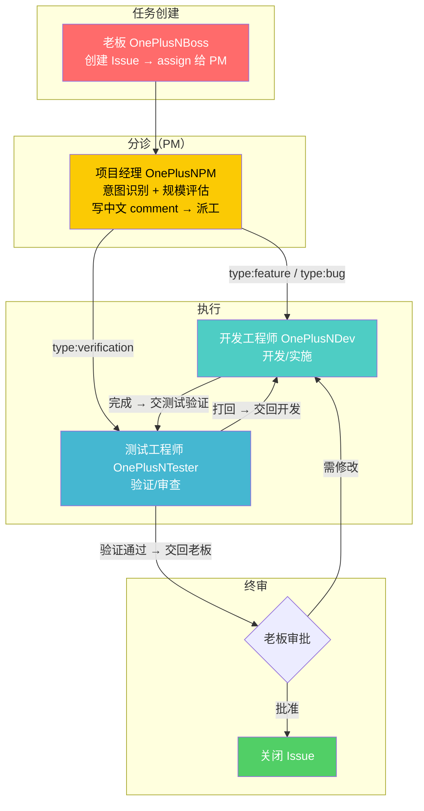
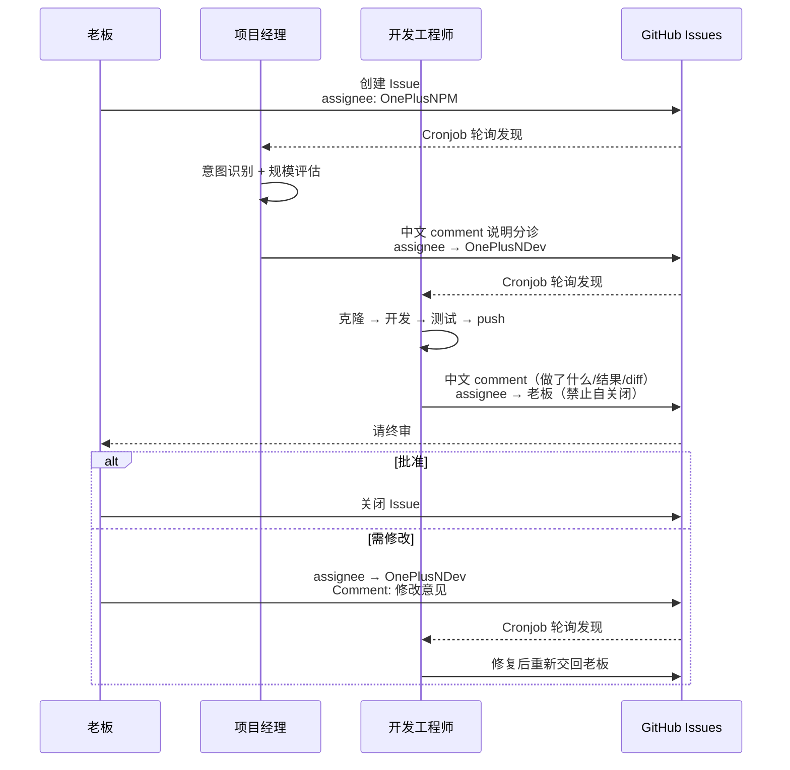

# demo-oneplusn — 协作协议

> Assignee = 轮到谁。Comment = 沟通。Close = 完成。

## 协作全景

> **核心约定：每个新 Issue 一律先 assign 给项目经理（PM）分诊，PM 再按类型派给执行者。**




## 团队成员

| 数字员工 | 角色 | GitHub | Gateway 端口 | 框架 | 升级模块 |
|---------|------|--------|-------------|------|---------|
| `demo-pm` | 项目经理（分诊） | @OnePlusNPM | 8081 | hermes | hindsight,search,efficiency,voice |
| `demo-dev` | 开发工程师 | @OnePlusNDev | 8082 | hermes | hindsight,search,efficiency,voice |
| `demo-tester` | 测试工程师 | @OnePlusNTester | 8083 | hermes | — |

> 全员使用本地 Ollama `qwen3.6:latest` 模型。流转链路：Boss → PM 分诊 → Dev 开发 → Tester 验证 → 老板终审。开发与测试均不可自行关闭 Issue。

## 角色

| 角色 | 职责 |
|------|------|
| 老板 | 创建 Issue、最终审批 |
| 开发工程师 | 开发、实施、修 bug |
| 审查员 | Code Review、验证、关闭 Issue |
| 架构师 | 系统设计、技术决策 |
| 项目经理 | 分诊、进度跟踪、资源协调 |
| 其他角色 | 按各自专业领域执行 |

## 核心规则（5条）

```
1. Assignee = 现在轮到谁。干完 → 换 assignee 交给下一个人
2. Comment = 沟通渠道。有问题写 comment，换人让对方看
3. 新 Issue 一律先给 PM 分诊 → PM 按类型派给执行者 → 开发交测试验证 → 验证通过交老板终审
4. 所有 Issue Comment 必须用中文（代码块和技术标识符除外）
5. 领任务时做意图识别 + 规模评估 + 拆解决策
```

> **铁律：开发工程师禁止自己关闭 Issue**，完成后交回老板（@OnePlusNBoss）终审。

> **铁律：Assignee 必须用命令真正变更！**
> ```bash
> gh issue edit <N> --remove-assignee 旧人
> gh issue edit <N> --add-assignee 新人
> ```
> 每个 Issue 只能有一个 Assignee。多人 assignee = 谁都不管 = 流转卡死。

## 任务流转示例



## 任务拆解

### 意图识别

| 类型标签 | 关键词 | PM 派给 |
|---------|--------|---------|
| `type:feature` | 开发、实现、新增 | 开发工程师 @OnePlusNDev |
| `type:bug` | 修复、bug、报错 | 开发工程师 @OnePlusNDev |
| `type:verification` | 测试、验证、审查 | 测试工程师 @OnePlusNTester |
| `type:research` | 调研、研究、分析 | 暂回老板 @OnePlusNBoss |
| `type:docs` | 文档、README | 暂回老板 @OnePlusNBoss |
| `type:decision` | 决策、审批 | 老板 @OnePlusNBoss |

### 规模评估

| 规模 | 代码行数 | 决策 |
|------|---------|------|
| XS | < 100 | 不拆 |
| S | < 200 | 不拆 |
| M | 200–1000 | 弹性拆分 |
| L | 1000–3000 | **必须拆** |
| XL | > 10000 | **Epic 级拆分** |

### 拆解原则
- 目标粒度 S，最多 5 个子任务，最多 2 层深度
- L 级优先按业务流程（垂直切片）拆分

## 标签

| 标签 | 含义 |
|------|------|
| `type:feature` | 功能开发 |
| `type:bug` | Bug 修复 |
| `type:verification` | 验证审查 |
| `type:research` | 调研分析 |
| `type:docs` | 文档 |
| `priority:critical` | 紧急 |
| `priority:high` | 重要 |
| `priority:normal` | 常规 |
| `priority:low` | 低优先级 |

## Cronjob

每个数字员工每 30 分钟轮询：

```bash
gh issue list --repo demo-oneplusn/demo-workflow --assignee @me --state open
```

## 最佳实践

- **验证报告**：一个 Comment 包含编译结果 + 代码审查 + 功能测试 + AC 对照 + 判决
- **改动量自证**：Issue 中附带 `git diff --stat`
- **research/**：每任务一个独立子目录
- **非代码文件**：单独提交或标记
- **记忆清理**：每晚自动归档过期记忆（>30天）

---

*本文档版本: v1.2 | 组织: demo-oneplusn | 仓库: demo-workflow*